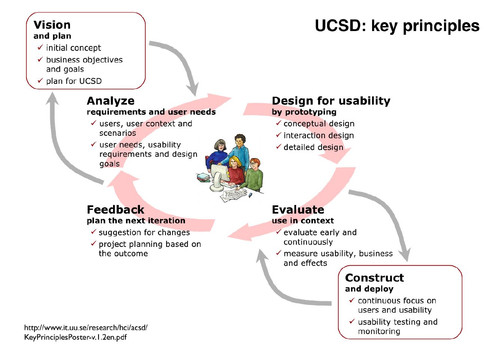
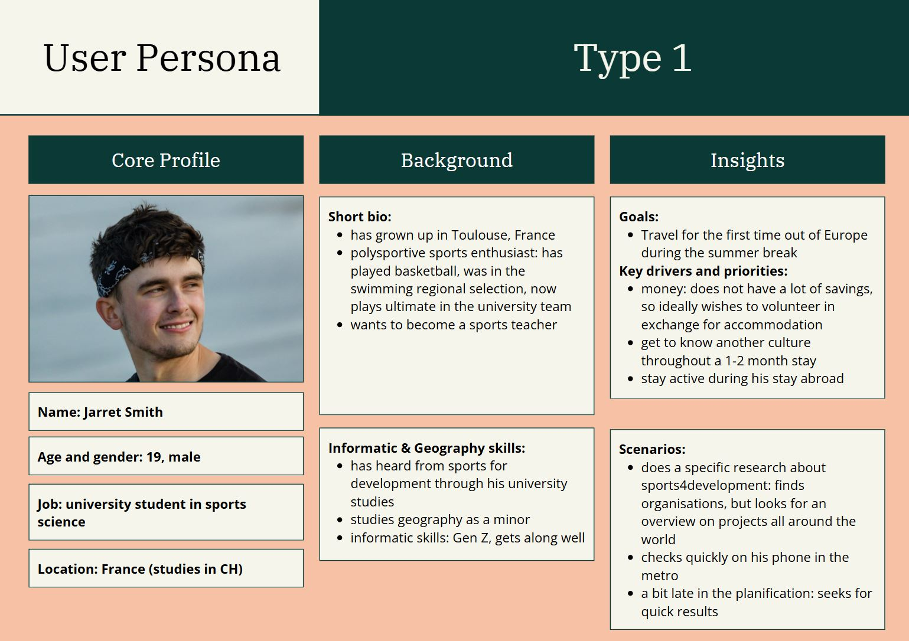
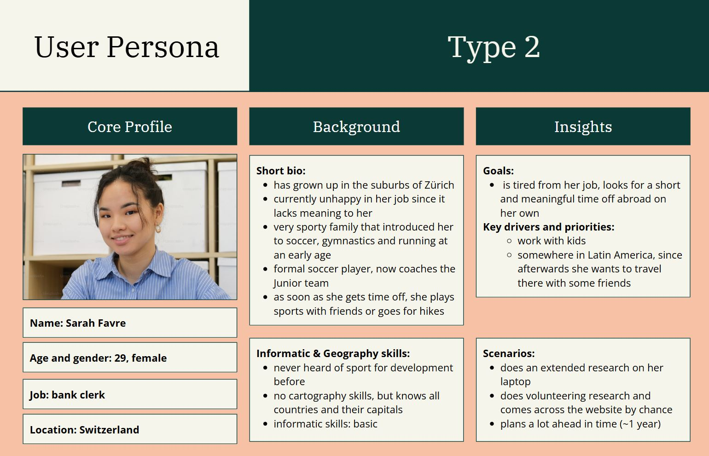
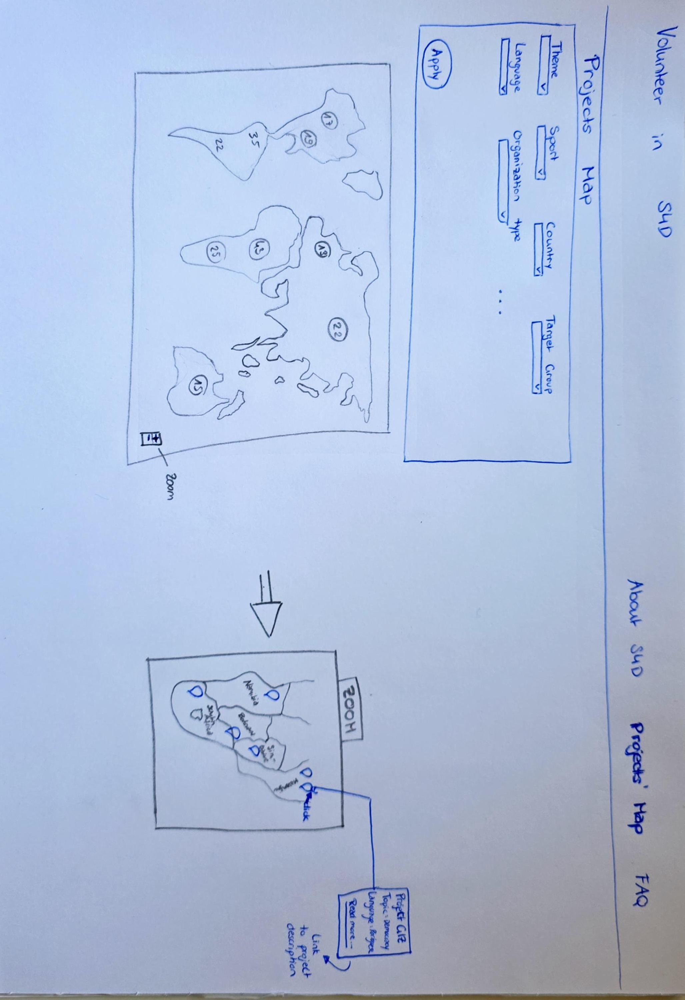
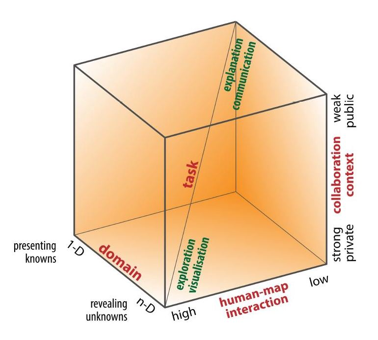
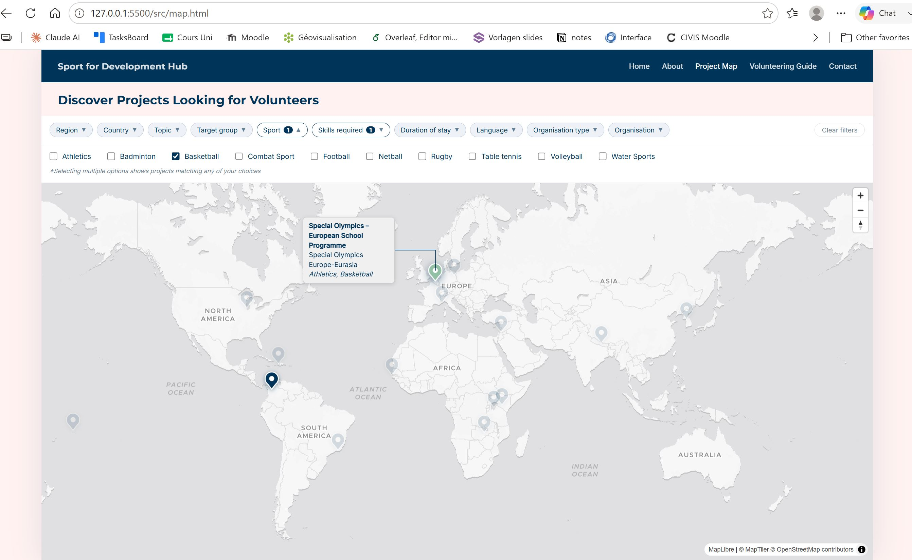
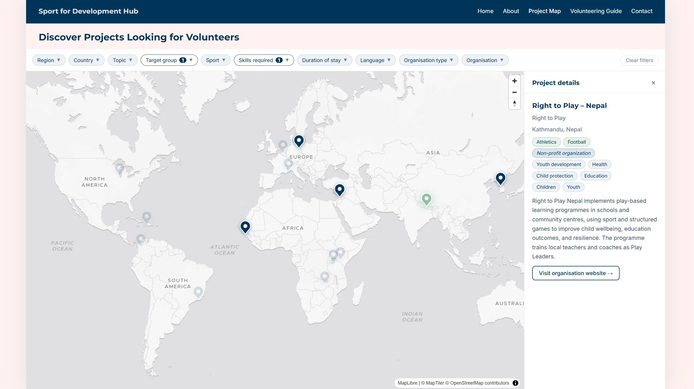

# Document de synthèse

Ce document a pour objectif d'expliquer le contexte, les réflexions et l'évaluation de la géovisualisation créée dans le cadre du cours _géovisualisation P26_. Il abordera comment accéder au projet de géovisualisation, les motivations personnelles à l'origine du projet, puis suivra chronologiquement les étapes de sa conception. La vision et le plan ayant guidé la conception du projet seront présentés en premier, puis l'implémentation concrète et l'évaluation seront abordées, avant d'ouvrir une discussion sur de futures pistes d'évolution.

## Comment accéder au projet de géovisualisation ?

Afin de pouvoir accéder à ce projet de géovisualisation, il est indispensable de télécharger le fichier ZIP **projet_geovis_Valerie_Vogel**  et d'en extraire tous les fichiers. De plus, il faut télécharger le programme Visual Studio Code.
Lorsque tous les fichiers ont été téléchargé en local sur l'ordinateur, il faut ouvrir [doc.code-workspace](../doc.code-workspace) avec Visual Studio Code. Ainsi, tous les fichiers s'ouvrent dans Visual Studio Code. Puisque le site n'a pas encore été publié, il faut y accéder localement à travers un _live server_. Pour ce faire, il suffit de faire un clic droite sur le fichier [index.html](../src/index.html), puis sélectionner l'option _Open with Live Server_ ou _Open in integrated browser_ selon la version de Visual Studio Code. Le projet de géovisualisation s'affichera alors dans le navigateur web par défaut de l'utilisateur.

## Motivation personnelle pour le projet

Tout d'abord, je souhaite expliquer comment j'ai décidé de créer un site web et une carte sur le sujet _Sport for Development (S4D)_.
 Le choix de ce sujet provient de mon intérêt profond pour cette approche. Etant donné que dans mes études de master en _Développement et Environnement_, les projets de coopération internationale sont analysés d'un point de vue très critique, il m'a fallu beaucoup de temps pour trouver une approche dans la coopération internationale, que je puisse à la fois considérer comme cohérente et défendre avec conviction. Je souhaite alors me dédier professionnellement à ce domaine, en Suisse ou à l'étranger. Ma motivation première était de pouvoir soumettre un projet concret lors de mes futures candidatures pour des postes de travail. En plus de cela, je souhaitais déjà maintenant, malgré que je ne travaille pas encore dans ce domaine, dédier mon temps et mes compétences à développer un projet qui a du sens et qui peut s'avérer utile pour autrui.
 D'un point de vue plus technique, je souhaitais me familiariser avec davantage d'outils pour la programmation de sites web et de cartographie. Cela me semble une compétence fortement utile pour se vendre sur le marché de travail. Puisque les LLM progrèssent à une vitesse élevé, j'ai décidé de ne pas apprendre la programmation depuis les bases, mais plus tôt de me focaliser sur comment utiliser les LLM comme outil afin de réaliser mon projet et mes objectifs. Cela me semblait bien plus pertinent au lieu de passer des heures à apprendre à programmer alors que cela sera de plus en plus remplacé par les LLM. Mon objectif était donc de découvrir comment se servir des LLM afin de réaliser ses idées et objectifs.

## Vision et plan

Gulliksen et al. (2003, p.401) définissent la conception de systèmes centrée sur l'utilisateur comme suit:  «User-centred system design (UCSD) is a process focusing on usability throughout the entire development process and further throughout the system life.»
Selon les principes de UCSD (cf. figure xx), j'ai d'abord centré mes réflexions sur la vision et les objectifs du projet de géovisualisation, les besoins des utilisateurs ainsi que les considérations de design, afin de garantir la conception d'un projet centré sur les besoins et les attentes de l'utilisateur. Cette section abordera alors les réflexions autour de la création du projet et les étapes parcourues, allant de la définition des objectifs jusqu'à la conception d'un prototype.

Figure xx - User centred system design principles (Gulliksen et al., 2003)

### Pourquoi cette visualisation ?

J'ai commencé par faire des recherches sur  le sujet S4D afin de trouver une potentielle lacune à combler. J'avais déjà une piste puisque j'avais essayé de trouver des projets dans ce domaine, afin de collaborer avec eux dans le cadre de mon travail de mémoire. Je me souvenais alors que j'avais eu beaucoup de peine à trouver des projets concrets. Chaque organisation met sur son site web les projets qu'elle a lancé, mais aucun site web ne regroupe les projets de toutes les organisations de S4D. Par conséquent, la recherche pour trouver un projet prend beaucoup de temps puisqu'il faut parcourir chaque site web.
Le site [sportanddev](https://www.sportanddev.org/), qui se veut une plateforme internationale du sujet, ne regroupe uniquement les organisations et non les projets de ces-mêmes.
Je me suis donc dit qu'il était dommage que des personnes souhaitant s'investir dans ces projets abandonnent par manque d'informations centralisées ou découragées par l'effort que cela représente. Il en ressort un besoin de centralisation visuelle des projets de S4D en cours, couvrant divers sports, organisations et domaines thématiques. Ainsi est née l'idée d'offrir aux potentiels bénévoles une vue d'ensemble des initiatives existantes et dans un second temps, de leur faciliter la prise de contact avec les organisations concernées. La simple création d'une carte ne semblait toutefois pas suffisante pour fournir assez de contexte, c'est pourquoi elle a été intégrée dans un site web permettant de contextualiser la carte et d'informer sur l'approche S4D pour ceux qui n'en auraient encore jamais entendu parler.

### Objectifs et justification

Ce projet de géovisualisation se compose de deux parties : le site web et la carte interactive. Le site web a pour objectif d'introduire l'approche S4D, tandis que la carte interactive vise à montrer aux personnes souhaitant faire du bénévolat où se trouvent les projets en cours à la recherche de bénévoles. Ces deux composantes répondent alors à des questions distinctes. Le site web a pour objectif de répondre à la question:
- Qu’est-ce que l’approche S4D ?

La carte interactive, quant à elle, vise à répondre à la question:
- En fonction des compétences et préférences personnelles, où se trouvent des projets de S4D en cours, qui sont à la recherche de bénévoles ?

Cette géovisualisation est donc importante car elle comble une lacune sur le web. Selon mes connaissances, il n'existe à ce jour aucun répertoire regroupant les projets de diverses organisations de S4D à travers différents pays. Afin de faciliter la recherche pour les utilisateurs, il est pertinent de centraliser l'accès à l'information sur une carte interactive dotée de filtres avancés et l'intégrer dans un site web dédié à la thématique. Ce projet répond ainsi à un besoin concret et identifié.

### Public-cible

Afin de pouvoir créer un UCSD, il est indispensable de connaître les besoins de l'utilisateur et la _usability_ (Gulliksen et al., 2003). A cette fin, deux personas ont été imaginées dans le cadre de ce projet (cf. figure xx et figure xx). Les personas sont des personnes ou des utilisateurs types fictionnels qui représentent différents comportements, objectifs et motivations jugés représentatifs du public-cible. Le public-cible est bien entendu composé de plus de diversité. Toutefois, imaginer la description d'un utilisateur type et dans quelles situations il utilise la géovisualisation, permet de concevoir un design adapté (Calde et al., 2002).

La définition des personas a permis de prendre des décisions sur divers aspects de la conception. Pour le site web, il en découlait qu'il ne serait créé qu'en anglais, puisque les deux personas sont plutôt jeunes et voyageuses, et disposent donc très probablement de bases dans cette langue.
Étant donné que les personas sont jeunes, elles ont également en commun d'être à l'aise en informatique et dans l'utilisation d'outils technologiques. Quant aux connaissances en cartographie, l'une des personas en a davantage que l'autre. Toutefois, aucune des deux n'est considérée comme experte dans ce domaine. Ainsi, il était clair qu'il fallait concevoir une carte destinée à des profanes plutôt qu'à des experts.
Bien que les deux personas soient passionnées par le sport, seule l'une d'entre elles effectue une recherche ciblée pour des projets de S4D. La persona 2 n'en a jamais entendu parler. Ce constat a conduit à la décision d'intégrer la carte interactive dans un site web afin de la contextualiser. L'objectif étant de centraliser les informations, il semblait pertinent, au vu de ces scénarios d'utilisation, de concevoir une introduction à l'approche afin que l'utilisateur ne doive pas naviguer sur d'autres sites pour comprendre de quoi il s'agit.
La définition des personas a également permis de réfléchir aux filtres à intégrer à la carte interactive en fonction des objectifs, motivations, souhaits et compétences propres à chaque persona.
Les contextes de l'utilisation de la géovisualisation sont distincts. Persona 1 effectue une recherche rapide sur son smartphone, tandis que persona 2 fait une recherche avancée sur son ordinateur. Ce constat a mis en évidence la nécessité d'adapter le design à l'appareil sur lequel la géovisualisation sera utilisée. Les modes d'interaction ainsi que les tailles d'écrans diffèrent entre les smartphones et les ordinateurs. Ces considérations ont guidé la planification du projet, afin d'adapter le design et les fonctionnalités de la géovisualisation aux contraintes de chaque type d'appareil.

### Cadre technique

Avant d'implémenter le projet, il est important de réfléchir au cadre technique. A travers la bonne planification de ce-même permet d'anticiper la cohérence et la compatibilité entre les différents outils et programmes.

Durant la planification, il a donc été définie que le site web allait être développé en HTML, CSS et JavaScript. Le fichier HTML permet de structurer le contenu, alors que le fichier CSS définit le style visuel et le JavaScript est dédié à l'interactivité du site. J'ai pris ces choix en fonction de recommendations du LLM qui affirmait que cette combinaison constitue l'approche standard pour le développement de sites web statiques. J'ai souhaité programmer le site depuis la base sans utiliser aucun framework.
Des échanges avec le LLM ainsi que des recherches approfondies ont montré que l'utilisation d'un _back-end server_ n'est pas nécessaire, étant donné que pour l'instant le contenu pour la géovisualisation est peu dynamique, que les données sont stockés dans un fichier statique et qu'il n'y a ni login ni formulaire à traiter.

La bibliothèque cartographique utilisé pour ce projet est [MapLibre GL JS](https://maplibre.org/maplibre-gl-js/docs/). Il s'agit d'une bibliothèque open source qui gère l'affichage et l'interactivité de la carte.
Le modèle [_dataviz light_](https://cloud.maptiler.com/maps/dataviz-v4-light/?_gl=1*1c06ydg*_gcl_au*ODkwNjM4MjI3LjE3Nzk2OTY2OTYuOTM0NTM0OTY3LjE3Nzk2OTY3MDIuMTc3OTY5NjcwMQ..*_ga*MTI3NjExNzA0Mi4xNzc5Njk2Njk3*_ga_K4SXYBF4HT*czE3Nzk2OTY2OTYkbzEkZzEkdDE3Nzk2OTc2ODEkajYwJGwwJGgw) a été extrait comme fond de carte à partir du service de tuiles vectorielles [MapTiler Cloud](https://cloud.maptiler.com/maps/).

Dans un premier temps, j'avais pensé utiliser des tuiles raster et donc j'avais initialement utilisé la bibliothèque [Leaflet JS](https://leafletjs.com/) avec des tuiles raster [OpenStreetMap](https://www.openstreetmap.org/#map=2/12.9/-59.9). J'avais trouvé un modèle de fond de carte en couleurs claires qui me semblait initialement assez discret. En échangeant avec mon superviseur, j'ai alors réalisé qu'un fond de carte en nuances grises permettait de mieux faire ressortir mes données. Par ailleurs, en raison de mon manque d'expérience, je ne m'étais pas rendu compte que, contrairement aux tuiles raster, les tuiles vectorielles offrent un rendu net à tous les niveaux de zoom. J'avais également envisagé de personnaliser le fond de carte moi-même, ce qui n'est possible qu'avec les tuiles vectorielles. J'avais abandonné cette idée assez rapidement faute de temps à disposition. Finalement, étant donné que le zoom était prévu comme option d'interactivité, il semblait évident qu'il fallait passer des tuiles raster aux tuiles vectorielles afin de garantir la qualité de l'affichage.
Ce choix impliquait le changement de la bibliothèque Leaflet JS vers Maplibre GL JS puisque Laeflet JS ne supporte pas les styles GL vectoriels (style.json). MapLibre GL JS a alors été adopté, car il prend en charge nativement ce format. De plus, il pouvait accueillir le modèle de fond de carte _dataviz light_ gratuitement accessible. D'autres modèles du même type, tels que celui d'esri, n'étaient pas accessibles gratuitement. Cela a orienté le choix final. Toutefois, l'utilisation du modèle mis à disposition par MapTiler a impliqué que je devais modifier mon plan initial et recourir à une clé API puisque cet outil authentifie les requêtes d'accès à ses fonds de carte.

Pour le format de la base de données, il était initialement prévu d'utiliser un fichier excel nommé [database_projects.xlsx](../src/data/database_projects.xlsx). Toutefois, après avoir investi beaucoup d'heures à trouver des données réelles, donc d'organisations et institutions réellement à la recherche de bénévoles sans aboutir à des résultats satisfaisants, j'ai pris la décision de dans un premier temps, créer des données fictives en raison du cadre temporelle imposé par le semestre universitaire. Il s'agit de projets existants d'organisation et d'institutions, toutefois il n'est pas explicité s'ils sont réellement à la recherche de bénévoles. Dans un second temps, l'objectif est de contacter les organisations afin de mettre à jour les données fictives avec des données réelles.
En raison de ce problème rencontré, j'ai mis à disposition au LLM des sources et je lui ai demandé de créer le fichier [projects.json](../src/data/projects.json). Ce fichier allait donc servir de base de données dans un premier temps jusqu'à ce que les données réelles aient pu être mobilisés. Afin d'anticiper cela, le LLM a également créé un script python [convert_xlsx_to_json.py](../src/data/convert_xlsx_to_json.py) afin que dès que le fichier excel soit mis à jour, il peut être transformé en fichier json à travers le script. Ainsi, en quelques clics, les données présentées sur la carte interactives peuvent être mises à jour.
* Note: Je tiens alors à préciser que le fichier [database_projects.xlsx](../src/data/database_projects.xlsx) n'est seulement une ébauche, qu'il n'a pas été mis à jour et qu'il ne correspond pas aux données dans le fichier [projects.json](../src/data/projects.json).

En conclusion, mon plan du cadre technique initial a évolué au fur et à mesure de la conception du projet, puisque j'ai rencontré quelques difficultés et que certains choix n'étaient initialement pas bien pensés, en raison de mon manque d'expérience.

### Création d'un prototype

Comme défini dans les principes clés du UCSD (Gulliksen et al., 2003), la conception d'un prototype permet d'ancrer les choix de design dans les besoins de l'utilisateur et d'obtenir ainsi une première représentation concrète de la géovisualisation. J'avais d'abord commencé à créer un prototype sur Inkscape, mais pour question de simplicité et d'efficacité, je l'ai finalement réalisé sur papier.

Figure xx - Le prototype sur papier

La conception du prototype se focalise sur la carte interactive puisque c'est concrètement cet élément qui demande le plus de choix au niveau du design et dont il est primordial qu'il soit adapté aux besoins de l'utilisateur.
Le prototype (cf. figure xx) montre une carte mondiale avec des numéros à divers localisations ainsi qu'un bouton de zoom intégré sur un site web. Les numéros représenent de manière agrégée le nombre de projets existants dans une région donnée. En zoomant, les labels des pays s'affichent et les numéros sont remplacés par des _pins_ des projets précisément localisés.
En cliquant sur un _pin_, un info-bulle s'affiche indiquant le nom du projet, quelques informations synthétiques et la fonction sous-ligné _read more_ signalant ainsi qu'il est possible d'obtenir davantage d'informations sur le projet. Il fallait alors décider si en cliquant dessus, l'utilisateur est renvoyé au site de l'organisation du projet ou si un maximum d'informations est mis en évidence sur mon site. Malgré l'idée de vouloir centraliser les informations, la fonction de mon site ne consiste pas à fournir des informations aussi détaillées. De plus, cela prendrait trop de temps de les mettre à jour régulièrement. C'est pourquoi, pour obtenir davantage d'informations, l'utilisateur est renvoyé vers les sites des organisations concernées.
Quant au site web dans lequel la carte est intégrée, il présente une barre de navigation contenant les sections _About S4D, Projects' Map_ et _FAQ_. De plus, il contient une sorte de cadre au-dessus de la carte qui affiche une multitude de filtres. Les séléctions possibles pour ces filtres sont affichés en cliquant sur le menu _dropdown_. En rétrospective, je dois admettre que je n'avais pas encore précisément réfléchi à comment visualiser les filtres appliqués.

## Conception

Après avoir réfléchi à la vision et avoir créé un prototype, je me suis mise à la conception du projet. Cette partie aborde alors toutes les parties liées à l'implémentation concrete.

### Rédaction du Readme

La première étape dans l'implémentation était de rédiger un README détaillé, expliquant les idées, les objectifs, la structure de la géovisualisation, les informations techniques et les outils à utiliser. Cette étape reflète l'approche de documenter d'abord, qui sert de spécification pour le LLM lors de la construction de la géovisualisation (Kaiser, 2026). Ce document est accessible via [readme.md](../readme.md).

### Utilisation du Large Language Model (LLM)

En tant que LLM, j'ai utilisé Claude Sonnet 4.6 d'Anthropic, dans sa version payante. Je l'ai toujours utilisé dans le mode _ask before edit_.
Tout échange avec le LLM a été documenté de manière transparente dans [agents.md](../agents.md). Les prompts, les dates ainsi que les réponses du LLM y figurent. Toutefois, pour des échanges plus longs et plus avancés, je n'ai pas structuré les échanges en prompt-réponse, mais j'ai simplement copié-collé l'échange entier. J'ai également été transparente sur le site web en déclarant avoir utilisé un LLM pour la conception du site et de la carte.
J'ai utilisé le LLM selon les trois étapes : documentation, implémentation et évaluation (Kaiser, 2026). Dans un premier temps, j'ai créé l'arborescence afin de structurer les fichiers du projet. Puis, j'ai fourni au LLM le README détaillé, afin qu'il rédige un plan d'implémentation auquel j'ai apporté quelques adaptations avant de finalement l'exécuter. Ensuite, avec ce premier résultat, j'ai amélioré le projet de manière itérative. Les petites modifications, je les ai entreprises moi-même, tandis que pour les changements plus fondamentaux, j'ai sollicité le LLM. Des captures d'écran ou des descriptions de tâches et de bugs ont permis d'avancer dans l'évaluation et l'amélioration de la géovisualisation.

Concrètement, le LLM m'a aidé à concevoir:
- la structure du site web et de la carte (en HTML et JavaScript)
- la traduction du style souhaité en langage CSS
- les fonctions d'interactivité de la carte
- la gestion de la base de données: conception du fichier json, script python pour transformer le fichier Excel en fichier JSON
- corrections majeures de bugs
- conseils sur des choix techniques, de design et corrections de textes

Les parties dont je me suis occupée de manière majoritairement autonome sont:
- rédaction du README (demandes de corrections au LLM)
- rédaction du document de synthèse (utilisation du LLM uniquement à des fins d'orthographe et de grammaire)
- fournir les sources d'informations et création de tous les textes (utilisation du LLM uniquement à des fins d'orthographe et de grammaire)
- réfléxions sur le design de la géovisualisation selon la bibliographie et ce qui a été vu en cours
- choix de la palette de couleur et des images
- adaptations mineures dans le code, telles qu'ajouts de textes, petits changements de style, éditions dans la base de données, adaptations dans la structure des fichiers HTML et CSS
- recherche de bugs et réflexions critiques sur la logique du projet

### Réfléxions et justifications 

Tout au long de la conception, autant pour le site web que pour la carte interactive, le principe de simplicité de la représentation a guidé les choix de design, afin que l'interface reste compréhensible et accessible pour l'utilisateur (Gulliksen et al., 2003). L'utilisation d'une palette de couleur limitée, la conception d'ineractions intuitives, de polices d'écriture bien lisibles ou encore la navigation et structure claire en témoignent.

**Le site web**

Pour le site web, j'ai créé les sections suivantes avec leur objectif spécifique:
- _About_: introduire à sujet S4D
- _Project Map_: trouver des projets de bénévolat selon préférences et compétences personnelles
- _Volunteering Guide_: guider les bénévoles potentiels dans leur démarche en fournissant des informations pratiques, des réponses aux questions fréquentes et des ressources utiles
- _Contact_: définir l'impressum et dans un second temps, lorsque le site sera publiquement accessible, permettre aux organisations d'annoncer leur offre de bénévolat afin qu'elle soit intégrée sur le site

Sur l'ensemble du site, j'ai veillé à la cohérence visuelle (Shneiderman & Plaisant, 2004). Ainsi, j'ai défini une palette de couleur se composant de ces 4 couleurs principales:
- Primary : #003459 — bleu marine foncé
- Accent : #93C0A4 — vert sauge
- Background : #FFF2F1 — blanc cassé chaud
- White : #FFFFFF

Le choix de la palette de couleurs s'est faite sur [coloors](https://coolors.co/) en respectant les principes de différenciation des couleurs et l'accessibilité pour les daltoniens, grâce au simulateur de daltonisme intégré à l'outil.

Cette palette de couleurs a été utilisée dans le design du site web ainsi que sur la carte interactive. Afin d'assurer la cohérence des couleurs affichées, j'ai décidé de personnaliser les _pins_ sur la carte en _primary color_. Les mises en évidence de fonctions additionnelles, telles que signaler qu'il est possible de cliquer sur une option ou indiquer qu'un élément de l'accordéon est ouvert, sont réalisées en couleur _accent_.

De plus, afin d'être cohérente dans le contenu, les mêmes termes ont été retenus entre les _Focus Areas_ de la page _About_ et les filtres applicables à la carte interactive. Ainsi, un utilisateur qui découvre des thématiques sur la page _About_ retrouvera principalement les même termes dans les filtres de la carte, facilitant la navigation et la recherche de projets correspondants.

La règle de la _vue initiale prête_ de Shneiderman et Plaisant (2004) a été respectée puisque la _landing page_ du site web montre directement toutes les sections à découvrir et affiche les thématiques que le site aborde. Ainsi, toutes les options et explorations possibles sont immédiatement affichées. L'option du _shortcut_ pour les utilisateurs fréquents a également été prise en compte. Si un utilisateur connaît déjà le site, il peut en un seul clic sur le bouton _Explore the Maps_ arriver directement sur la carte.
Finalement, la gestion simple des erreurs a été considérée en implémentant la fonction du clic sur _Sport for Development Hub_ en haut à gauche dans la barre de navigation afin de revenir sur la _landing page_. Ainsi, si un utilisateur a cliqué par accident sur une fonction ou une page, il peut simplement revenir en arrière et recommencer depuis le début (Shneiderman & Plaisant, 2004).

Afin de guider l'utilisateur à travers le site, une navigation avec des éléments telles que le _call to action_ sur l'image hero de la _landing page_, des boutons sur les cartes d'introduction ainsi que sur les pages _About_ et _Volunteering Guide_ ont été conçus. La barre de navigation en haut à droite permet à l'utilisateur de se repérer et de naviguer librement entre les sections à tout moment. J'ai toutefois décidé de ne pas ajouter de boutons sur la page de la carte interactive, afin de ne pas surcharger l'interface et de maintenir le focus de l'utilisateur sur cet élément central.

Pour la section _Focus Areas_ de la page _About Sport for Development_, l'idée initiale était de concevoir des hexagones avec des icônes représentant les différentes thématiques au sein desquelles les projets de S4D opèrent. En survolant les hexagones, davantage d'informations sur la thématique devaient s'afficher.
Toutefois, après avoir implémenté une première version des hexagones sur le site, le design ne m'a pas convaincue. Avec du recul, je me suis demandé si ce design apportait réellement une plus-value à l'utilisateur. Munzner (2014) affirme qu'il faut non seulement réfléchir à l'utilité que la 3D peut apporter, mais également se demander si une représentation visuelle est justifiée, car une simple liste permet parfois de représenter l'information de manière tout aussi concise. Après réflexion, j'ai réalisé que la représentation sous forme d'hexagones retournables avec icônes n'était pas justifiée. En appliquant le principe de simplicité (Gulliksen et al., 2003), il semblait plus pertinent de créer un accordéon, qui remplit aussi bien la tâche de donner une vue d'ensemble des thématiques et d'afficher davantage d'informations en un clic, si l'utilisateur souhaite en explorer une. 

Comme évoqué dans le chapitre dédié à la planification, des réflexions et des adaptations de design ont été faites en fonction des contraintes de chaque type d'appareil. Sur ordinateur, une marge blanche de chaque côté a été conçue afin de faire ressortir le contenu. Sur le smartphone avec une taille d'écran limitée, ces marges ont été supprimées en dessous de 600 pixels de largeur d'écran.

**La carte interactive**

Selon le cube cartographique de MacEachren (1994), toute visualisation cartographique peut être positionnée selon le public visé, la tâche poursuivie et le niveau d'interactivité (cf. figure xx). Cette géovisualisation se positionne clairement du côté public, puisqu'elle s'adresse à des bénévoles potentiels extérieurs au projet. Elle relève davantage de la présentation que de l'exploration, puisqu'elle communique des données connues plutôt que de chercher à découvrir des patterns inconnus. Enfin, le niveau d'interactivité est élevé puisque l'utilisateur peut filtrer les projets selon ses préférences, survoler les _pins_ pour obtenir un résumé et cliquer dessus pour accéder aux détails. Les fonctions de filtrage et de mise en évidence, permettant d'interagir directement avec les données, constituent une réelle plus-value justifiant le choix d'une carte interactive (Crampton, 2013). En effet, une carte statique n'aurait pas permis à l'utilisateur d'explorer les données selon ses propres critères.

  
Figure xx - Le cube cartographique (MacEachren, 1994)

Pour la conception de l'interface de la carte interactive, le mantra de Shneiderman _Overview first, zoom and filter, then details on demand_ (1996) a été appliqué. Lors de l'arrivée sur la page, la carte s'affiche à un niveau de zoom mondial, montrant le monde entier afin d'offrir une vue d'ensemble. Cela correspond également au principe de la vue initiale prête (Shneiderman & Plaisant, 2004). Contrairement à ce qui avait été prévu dans le prototype, faute de données suffisantes, aucun numéro n'est affiché sur les _pins_ pour indiquer combien de projets se situent dans une région. Les _pins_ affichent directement la localisation des projets sur la carte mondiale (cf. figure xx). Dans un second temps, l'utilisateur peut agrandir la carte à l'aide du bouton +/−. Des détails supplémentaires tels que les labels des pays, des villes ou encore des rues s'affichent alors progressivement, de même que des couches additionnelles comme les bâtiments et les lacs, à partir d'un certain niveau de zoom.

Figure xx - La carte interactive avec les fonctions de filtres appliqués et _hover 

Puis, des filtres peuvent être appliqués en utilisant les cases à choix multiples au-dessus de la carte. Cette sélection se fait par un clic sur la case souhaitée. La fonction de filtre permet de mettre en évidence les projets auxquels les critères choisis s'appliquent. Au sein d'une même catégorie de filtre la logique OR a été retenue. Un projet s'affiche s'il correspond à au moins l'un des critères sélectionnés. Cela permet à l'utilisateur de consulter l'ensemble des projets liés à ses différents intérêts sans les exclure mutuellement. Il peut par exemple explorer différents sports simulantément. Entre les catégories de filtres, comme _sport_ et _region_, la logique AND a été appliquée. Seuls les projets répondant à l'ensemble des critères actifs s'affichent. Cette combinaison permet à l'utilisateur d'avancer progressivement sa recherche selon ses préférences et compétences personnelles.
Finalement, les détails sont donnés sur demande. Ainsi, en faisant un _hover over_ le _pin_, seul un aperçu de quelques informations synthétiques s'affiche. C'est seulement en cliquant sur le _pin_ que davantage d'informations s'affichent dans un panneau latéral à droite de la carte et seulement en cliquant sur _visit organisation website_ encore plus d'informations sont accessibles (cf. figure xx). Ce système permet d'économiser le nombre de clics et contribue donc à l'efficience de l'interface pour l'utilisateur.

Figure xx - L'affichage de détails sur demande

La fonction du _hover over_ n'est toutefois seulement pertinente que pour l'affichage sur ordinateur puisque cette option n'existe pas sur les écrans tactiles des smartphones. Ainsi, pour les smartphones, la fonction _hover over_ a été supprimée. En cliquant sur un _pin_, une feuille inférieure s'affiche directement, donnant toutes les informations en détail. Cette adaptation prend alors en compte les contraintes de l'appareil utilisé.

La règle d'or 4, qui demande d'établir une séquence guidée par une progression et une fin clairement définie, a été prise en compte (Shneiderman & Plaisant, 2004). La séquence commence par une vue initiale de la carte affichant les projets avec les _pins_ bleus. L'utilisateur peut ensuite appliquer des filtres, _hover over_ un projet pour afficher des informations synthétiques, cliquer dessus pour en afficher davantage, et finalement soit cliquer sur le lien redirigeant vers le site de l'organisation concernée, soit revenir en arrière en cliquant sur un autre projet ou en utilisant _clear filters_. La séquence prend ainsi une fin définie. De plus, chaque interaction sert à une tâche spécifique.

Les explications ci-dessus montrent que toute action permettant d'interagir avec l'interface est initiée par l'utilisateur, ce qui correspond à la règle 7 _Support internal locus of control_ (Shneiderman & Plaisant, 2004). L'utilisateur ne réagit pas à une action imposée, mais c'est lui qui a le contrôle de l'initier.

Toutefois, au regard du principe de simplicité, la question se pose: est-ce qu'une simple carte statique n'aurait pas été suffisante ? Est-ce que l'interactivité est réellement nécessaire ?
En effet, il aurait été possible d'afficher les données sur une carte statique. Toutefois, étant donné que l'objectif de la carte est de montrer les projets existants en fonction des préférences et compétences personnelles, une interaction avec les données est pertinente. La fonction des filtres permet cette interaction avec les données, qui constitue la réelle plus-value de la carte. De plus, une carte statique aurait risqué de paraître surchargée. L'interactivité permettant d'afficher des informations séléctionnées permet de donner un cadre aux informations affichées et d'en maintenir la sobriété.

Pour la représentation cartographique, j'ai fait les choix suivants:
- projection de Mercator Web (EPSG:3857), qui constitue le standard des cartes en ligne et que MapLibre GL JS utilise par défaut
- flèshe nord comme l'exigent les principes cartographiques
- fond de carte: en nuances de gris afin de le garder silencieux et ainsi, faire ressortir les _pins_ bleus qui représentent l'information centrale que la géovisualisation a pour objectif de communiquer
- _wrap apround_ désactivé pour des raisons de simplicité et puisque cette fonction n'apporte pas de valeur ajoutée 
**(aussi bloquer de pouvoir tourner carte n'importe comment ?)**
- la fonction _hover over_ fait afficher une ligne qui lie le _pin_ à une bulle d'information afin d'éviter l'occultation de la zone cartographique environnante. Cette ligne s'oriente en fonction de la localisation du _pin_ sur la carte. Dans le quart en haut à droite, la bulle s'affiche vers le haut et vers la droite tandis que dans le quart en bas à gauche, elle s'affiche vers le bas et vers la gauche. Cette logique de positionnement adaptatif garantit que la bulle ne déborde jamais hors des limites de la carte et préserve ainsi la lisibilité des données environnantes.

Les variables visuelles de la carte ont été choisies soigneusement. Afin de représenter l'information centrale des projets, il a été veillé à utiliser les variables visuelles les plus efficaces. Selon MacEachren (1995) la position est la variable visuelle la plus efficace, suivie de la taille et de la couleur. Ainsi, afin de représenter les projets, la localisation des _pins_ a été utilisée. De plus, une taille assez importante, a été séléctionnée pour les _pins_. La prise en compte du zoom a toutefois imposé une limite dans la taille à choisir puisque sinon le _pin_ aurait occulté de parties trop importantes de la carte. Puis, la _primary_ couleur, forte et contrastante avec le fond de carte silencieux a été choisie afin d'attirer le regard sur cette information.
La bibliothèque MapLibre GL JS permet la personnalisation des pins. Alors, j'ai demandé au LLM de créer un pin personnalisé afin de respecter les principes ci-dessus. Le design du pin personnalisé a été élaboré de manière itérative à l'aide du LLM, jusqu'à l'obtention d'un résultat satisfaisant.

La fonction _clear filters_, placé à droite des filtres à séléctionner (cf. figure xx), répond à la règle d'or _permit easy reversal of actions_ (Shneiderman & Plaisant, 2004). Ainsi, si l'utilisateur a coché une case par erreur,il peut en un seul clic revenir à la vue initiale affichant tous les projets existants, grâce à la fonction _clear filters_ qui supprime la sélection des filtres appliqués.

La règle d'or 3 de Shneiderman et Plaisant (2004) exige d'offrir un retour informatif. Sur la carte interactive, cela a été pris en compte par les choix suivants:
- une transparence plus élevé des _pins_ sur la carte lorsque le critère d'un filtre ne s'applique pas à un projet, afin de faire ressortir les projets auxquels ce critère s'applique (cf. figure xx) 
- le changement de couleur du _pin_ de la _primary color_ à _accent color_, lorsque l'utilisateur le survole avec la souris afin de signaler qu'il est possible de cliquer dessus (cf. figure xx)
- l'affichage d'un résumé synthétique lorsque l'utilisateur survole avec la souris un projet afin de lui permettre une vue d'ensemble pour savoir s'il est intéressé ou non à poursuivre la recherche et obtenir davantage d'informations (cf. figure xx).

MINI PHRASE POUR CONCLURE

## Evaluation

Cette section est dédiée à l'évaluation du projet de géovisualisation. Elle abordera les points forts et les faiblesses du projet, les tests utilisateurs, ainsi que les améliorations entreprises.

### Forces et faiblesses

**Forces**

- roth (2013) - entweder Kurs 1 oder 2 --> Pas plus de 1-2 secondes pour que la carte réagisse à l'interaction, sinon risque de rupture de la réfléxion visuelle et perte d'attention

**Faiblesses**
- Pas encore des données réelles
- prototype n'a pas été faite en coopération avec les utilisateurs (Gulliksen et al., 2003), je n'ai seulement testé

### Résultat des tests utilisateurs

Finalement, après avoir créé une première version du projet de géovisualisation, j'ai procédé à son évaluation par des utilisateurs, conformément aux principes du UCSD (cf. figure xx), afin de l'améliorer itérativement.

Retour amis hors fac, mais universitaire et famille (~10 personnes)
- Réfléxion sur catégories des filtres: athletes femmes (solution: ajouté note)
--> Décidé de ne finalement pas mettre la catégorie 'female athletes' car il ne me semble pas bien d'être catégorique dans la séparation des genres. De plus, souvent les projets travaillent avec des filles, mais impliquent aussi les garçons. Donc pour enlever le confusion, j'ai décidé d'ajouter une petite note, qui explique la logique 'OR' à l'intérieur des filtres.
- Hover over - pin devient bleu clair - rendre visible que possible de cliquer dessus
--> et ajouté note _click to read more_
- Créer des buttons de zoom

- changer d'image pour les différents sites, car sinon un peu monotone
- ajouter impressum
- amélioré navigation - guider utilisateur non seulement sur landing page
--> Décidé de ne pas ajouter de navigation au site avec le map, car c'est la plus-value de mon site web et mon objectif est que les gens atterrissent la-dessus

## Discussion

Future aims
- contacter organisations pour fournir données réelles sur le fait si elles recherchent des informations
- publier officiellement le site
- add contact formular for ONG's so that I can just add the information (mais du coup il faut passer à backend server)

- passage a backend serveur car maplibre est service avec quota, et donc ma clé API est publique et donc exposée en frontend - risque d'être volé ou utilisé par quelqu'un d'autre (à modifier si jamais je publie le site)

## Conclusion

Carte répond à gap identifié
- mais c'est clair qu'il faut le faire avec données réelles

## Bibliographie

Calde, S., Goodwin, K., & Reimann, R. (2002). SHS Orcas: The first integrated information system for long-term healthcare facility management. _Proceedings of the Conference on Human Factors and Computing Systems: CHI 2002/AIGA Experience Design Forum._ ACM Press.

Crampton J.W. (2002). Interactivity Types in Geographic Visualization. _Cartography and Geographic Information Science, 29_(2), 85-98. https://doi.org/10.1559/152304002782053314

Gulliksen, J., Göransson, B., Boivie, I., Blomkvist, S., Persson, J., & Cajander, Å. (2003). Key principles for user-centred systems design. _Behaviour & Information Technology, 22_(6), 397–409. https://doi.org/10.1080/01449290310001624329

Kaiser, C. (2026). _Géovisualisation et traitement de l'information — Semaine 5 : Mise en place d'un projet de géovisualisation_ [Diapositives de cours]. Faculté des géosciences et de l'environnement, Université de Lausanne.

MacEachren, A. M. (1994). Visualization in modern cartography: Setting the agenda. In A. M. MacEachren & D. R. F. Taylor (Eds.), _Visualization in modern cartography_ (Vol. 2, pp. 1–12). Academic Press. https://doi.org/10.1016/B978-0-08-042415-6.50008-9

MacEachren, A. M. (1995). _How maps work: Representation, Visualization & Design_. Guildford Press.

Munzner, T. (2014). _Visualization Analysis and Design._ A K Peters/CRC Press. https://doi.org/10.1201/b17511

Shneiderman, B. (1996). The eyes have it: a task by data type taxonomy for information visualizations. _Proceedings of the IEEE Symposium on Visual Languages_, 336-343, https://doi.org/10.1109/VL.1996.545307.

Shneiderman, B. & Plaisant, C. (2004). _Designing the User Interface: Strategies for Effective Human-Computer Interaction_ (4th Edition). Pearson Addison Wesley. 