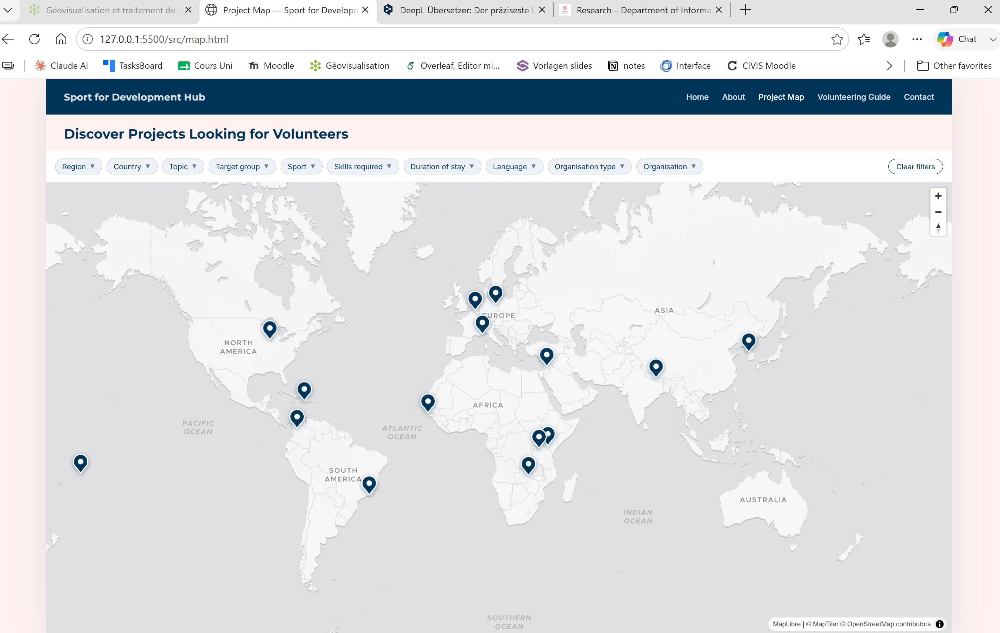

# Document de synthèse

Ce document a pour objectif d'expliquer le contexte, les réfléxions et l'évaluation personnelle de la géovisualisation créé dans le cadre du cours _géovisualisation P26_.

## Motivation personnelle pour le projet

Tout d'abord, je souhaite expliquer comment j'ai décidé de créer un site web et une carte sur le sujet _Sport for Development (S4D)_.
 Le choix de ce sujet provient de mon intérêt profond pour cette approche. Etant donné que dans mes études de master en _Développement et Environnement_, les projets de coopération internationale sont analysés d'un point de vue très critique, il m'a fallu beaucoup de temps pour trouver une approche dans la coopération internationale, que je puisse à la fois considérer comme cohérente et défendre avec conviction. Je souhaite alors me dédier professionnellement à ce domaine, en Suisse ou à l'étranger. Ma motivation première était de pouvoir soumettre un projet concret lors de mes futures candidatures pour des postes de travail. En plus de cela, je souhaitais déjà maintenant, malgré que je ne travaille pas encore dans ce domaine, dédier mon temps et mes compétences à développer un projet qui a du sens et qui peut s'avérer utile pour autrui.
 D'un point de vue plus technique, je souhaitais me familiariser avec davantage d'outils pour la programmation de sites web et de cartographie. Cela me semble une compétence fortement utile pour se vendre sur le marché de travail. Puisque les LLM progrèssent à une vitesse élevé, j'ai décidé de ne pas apprendre la programmation depuis les bases, mais plus tôt de me focaliser sur comment utiliser les LLM comme outil afin de réaliser mon projet et mes objectifs. Cela me semblait bien plus pertinent au lieu de passer des heures à apprendre à programmer alors que cela sera de plus en plus remplacé par les LLM. Mon objectif était donc de découvrir comment se servir des LLM afin de réaliser ses idées et objectifs.

## Pourquoi cette visualisation ?

J'ai commencé par faire des recherches sur  le sujet S4D afin de trouver une potentielle lacune à combler. J'avais déjà une piste puisque j'avais essayé de trouver des projets dans ce domaine, afin de collaborer avec eux dans le cadre de mon travail de mémoire. Je me souvenais alors que j'avais eu beaucoup de peine à trouver des projets concrets. Chaque organisation met sur son site web les projets qu'elle a lancé, mais aucun site web ne regroupe les projets de toutes les organisations de S4D. Par conséquent, la recherche pour trouver un projet prend beaucoup de temps puisqu'il faut parcourir chaque site web.
Le site [sportanddev](https://www.sportanddev.org/), qui se veut une plateforme internationale du sujet, ne regroupe uniquement les organisations et non les projets de ces-mêmes.
Je me suis donc dit qu'il était dommage que des personnes souhaitant s'investir dans ces projets abandonnent en raison du manque d'informations centralisées ou découragées par l'effort que cela représente.
Ainsi est née l'idée de créer une carte regroupant les projets de S4D en cours, incluant divers sports, organisations et domaines thématiques. L'idée est d'offrir aux potentiels bénévoles une vue d'ensemble des initiatives existantes et au final leur faciliter la prise de contact avec les organisations concernées.
La simple création d'une carte ne me semblait pas suffisante pour fournir suffisamment de contexte. C'est pourquoi j'ai décidé de l'intégrer dans un site web permettant de contextualiser la carte et d'informer sur l'approche S4D pour ceux qui n'en auraient encore jamais entendu parler.

### Objectifs et justification

Mon projet de géovisualisation se compose de deux parties : le site web et la carte interactive. Le site web a pour objectif d'introduire l'approche S4D, tandis que la carte interactive vise à montrer aux personnes souhaitant faire du bénévolat où se trouvent les projets en cours à la recherche de bénévoles. Ces deux composantes répondent alors à des questions distinctes. Le site web a pour objectif de répondre à la question:
- Qu’est-ce que l’approche S4D ?

La carte interactive, quant à elle, vise à répondre à la question:
- En fonction des compétences et préférences personnelles, où se trouvent des projets de S4D en cours, qui sont à la recherche de bénévoles ?

Ce projet de géovisualisation est donc important car il comble une lacune sur le web. Selon mes connaissances, il n'existe à ce jour aucun répertoire regroupant les projets de diverses organisations de S4D à travers différents pays. Afin de faciliter la recherche pour les utilisateurs, il est pertinent de centraliser l'accès à l'information sur une carte interactive dotée de filtres avancés et l'intégrer dans un site web dédié à la thématique. Ce projet répond ainsi à un besoin concret et identifié.

- mettre schéma qui montre que d'abord commencer à réfléchir au besoin et après créer projet

### Public-cible

- Personas (pictures) --> mettre source bibliographique
- Public-cible serait bien-sûre encore bcp plus large mais avec personas un aperçu des personnes types que j'estime qui tomberont sur mon site ou l'utiliseront avec la plus grande probabilité

## La visualisation

von Präse: 05b_viz_example_pres --> approche 'documentation d'abord': 1. Documentation (définir objectifs, contenu et cadre technique d'abord)
- donc aussi créé un prototype (d'abord dessin sur papier, puis demandé à LLM de créer prototype site web) -- add pictures
2. Implémentation
3. Evlauation

### Description

### Réfléxions et justifications 

SITE WEB
 --> strive for consistency - toujours même couleurs sur site web (définirion de primary color, accent color etc.) -- (Shneiderman & Plaisant, 2004, 8 règles d'or)

 --> vue initiale prête: landing page montre directement toutes les sections à découvrir, dit de quelle thématique le site parle
 et aussi _enable frequent users to use shortcuts_ : 'shortcut' directe vers la carte est possible (Shneiderman & Plaisant, 2004)

 --> offer simple error handling: possible de revenir sur la landing page en cliquant en-haut à droite sur _Sport for Development Hub_ // back button 

 --> prendre utilisateur par la main: le naviguer
 - avec buttons sur introduction cards sur landing page
 - avec navigation bar en-haut à droite
 - buttons aussi sur les sections 'about' et 'volunteering guide', décidé de ne pas les mettre sur la section de la carte afin de ne pas surcharger ce site, garder le focus sur la carte interactive et aussi puisque c'est l'élément central où je souhaite que le user reste

--> écriture et polices: Sans serif pour titre (sans les empattements en-bas des lettres) // Avec serif pour texte (nous permet de lire plus rapidement, car ca fait comme s'il y avait ligne dessous) (présentation 3b)

CARTE
--> appliqué le 'mantra de Shneiderman': «Overview first, zoom and filter, then details on demand» (présentation 5a et Shneiderman, B. (1996). The Eyes Have It: A Task by Data Type Taxonomy for Information Visualizations. Proc. IEEE Symposium on Visual Languages, 336–343.)
- Interactions: d'abord overview - directement vue sur la carte zoom mondial pour la vue d'ensemble
--> règle de 'vue initiale prête' (présentation 4b)
- possible de filtrer dans un second temps pour plus d'infos et de zoom in pour avoir plus d'infos (gentilment batiments, routes etc plus de détails qui s'affichent)
- details on demand: en faisant un hover over, et encore plus de détails en cliquant dessus
--> hover over (que fonctionnel et pertinent pour ordi pas des interfaces qui fonctionnent majoritairement avec un touchscreen): économiser les clics (efficient)
--> Options avancées avec un seul clic (cliquer sur pin, puis cliquer sur lien pour arriver à nouveau site web)

--> Interaction Carte
- chaque interaction doit servir une tâche spécifique (présentation 5a)
- Cases à cocher → sélection multiple (présentation 4b)

- offer informative feedback: pin turns 'transparent' when filters don't apply - stay dark blue if filters apply AND informative feedback of pin turning to 'accent color' so show that one can click on it

La règle d'or 3 de Shneiderman et Plaisant (2004) exige d'offrir un retour informatif. Sur la carte interactive, cela a été pris en compte par les choix suivants:
- une transparence plus élevé des _pins_ sur la carte lorsque le critère d'un filtre ne s'applique pas à un projet, afin de faire ressortir les projets auxquels ce critère s'applique (cf. figure xx) 
- le changement de couleur du _pin_ de la _primary color_ à _accent color_, lorsque l'utilisateur le survole avec la souris afin de signaler qu'il est possible de cliquer dessus (cf. figure xx)
- l'affichage d'un résumé synthétique lorsque l'utilisateur survole avec la souris un projet afin de lui permettre une vue d'ensemble pour savoir s'il est intéressé ou non à poursuivre la recherche et obtenir davantage d'informations (cf. figure xx).

Figure xx - Un retour informatif

Les explications ci-dessus montrent que toute action permettant d'interagir avec l'interface est initiée par l'utilisateur, ce qui correspond à la règle 7 _Support internal locus of control_ (Shneiderman & Plaisant, 2004). L'utilisateur ne réagit pas à une action imposée, mais c'est lui qui a le contrôle de l'initier.

La règle d'or 4, qui demande d'établir une séquence guidée par une progression et une fin clairement définie, a été prise en compte (Shneiderman & Plaisant, 2004). La séquence commence par une vue initiale de la carte affichant les projets avec les _pins_ bleues. L'utilisateur peut ensuite appliquer des filtres, _hover over_ un projet pour afficher des informations synthétiques, cliquer dessus pour en afficher davantage, et finalement soit cliquer sur le lien redirigeant vers le site de l'organisation concernée, soit revenir en arrière en cliquant sur un autre projet ou en utilisant _clear filters_. La séquence prend ainsi une fin définie.

La fonction _clear filters_, placé à droite des filtres à séléctionner (cf. figure xx), répond à la règle d'or _permit easy reversal of actions_ (Shneiderman & Plaisant, 2004). Ainsi, si l'utilisateur a par erreur coché une case qu'il ne souhaitait pas sélectionner,il peut en un seul clic revenir à la vue initiale affichant tous les projets existants, grâce à la fonction _clear filters_ qui supprime la sélection des filtres appliqués.

Figure xx - La fonction _clear filters_

- justifier vos choix au niveau de la représentation cartographique, de l'interactivité, de la communication graphique et les aspects facilité d'utilisation, efficacité etc.
-sémiologie, interactions, communication graphique etc.

## Evaluation

### Forces et faiblesses

- Pas encore des données réelles

### Résultat des tests utilisateurs

dire que étape d'évaluer selon les utilisateurs

Retour amis hors fac, mais universitaire et famille (~10 personnes)
- Réfléxion sur catégories des filtres: athletes femmes (solution: ajouté note)
- Hover over - pin devient bleu clair - rendre visible que possible de cliquer dessus
- Créer des buttons de zoom

- changer d'image pour les différents sites, car sinon un peu monotone
- ajouter impressum
- back button ?

## Discussion

Future aims
- contacter organisations pour fournir données réelles sur le fait si elles recherchent des informations
- publier officiellement le site
- add contact formular for ONG's so that I can just add the information

## Conclusion

## Bibliographie